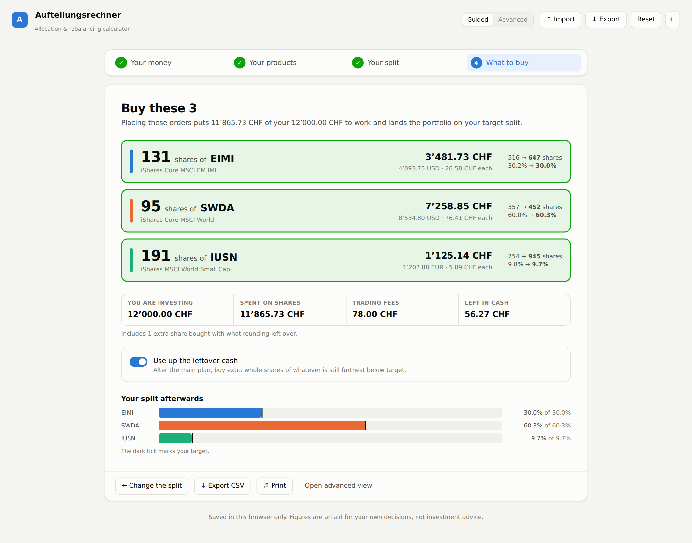

# Aufteilungsrechner — Portfolio Allocation & Rebalancing Calculator

A web app that replaces `Aufteilungsrechner.xlsx`: it works out **how many shares
to buy or sell** to bring a multi-currency portfolio back to its target
allocation, given the cash you want to add and the trading fees you will pay.

Unlike the spreadsheet it is not limited to three ETFs — positions are added,
removed, reordered and reweighted freely.

## The main flow

**Guided** mode walks the question end to end in four steps:

1. **Your money** — how much you are investing, and whether the plan may sell
   (buy-only is the default: new money goes where it is most needed, nothing is
   sold, no extra fees, no tax events).
2. **Your products** — add anything new, remove what you no longer want. A
   brand-new product is simply one with 0 shares held.
3. **Your split** — the target share for each product, on sliders that keep the
   total at 100% for you.
4. **What to buy** — the answer: *buy 131 shares of EIMI, 95 of SWDA, 191 of
   IUSN*, with the amount in both currencies, what you will hold afterwards, and
   where the split lands.



**Advanced** mode is the same engine as a single dense dashboard — every
position, setting and intermediate figure at once. The toggle is in the header
and your choice is remembered.


---

## Quick start

```bash
npm install
npm run dev        # http://localhost:5173
```

Other scripts:

| Command | What it does |
| --- | --- |
| `npm run build` | Typecheck and build the static site into `dist/` |
| `npm run preview` | Serve the production build locally |
| `npm test` | Run the calculation tests |
| `npm run typecheck` | TypeScript only |

`dist/` is a plain static bundle — any static host will serve it.

---

## The calculation

The engine (`src/lib/calc.ts`) follows the same chain as the original sheet:

```
value_i     = shares_i × unitPrice_i × fxRate_i      # holdings, in base currency
investable  = Σ value + cash − fees                  # "Gesamt"           (Q6)
target_i    = investable × targetWeight_i            # "Soll"             (Q7:Q9)
delta_i     = target_i − value_i                     # "Diff zu Soll"     (Q10:Q12)
rawShares_i = delta_i / priceInBase_i                #                    (Q19:Q21)
trade_i     = round(rawShares_i)                     # ROUNDDOWN by default (E24:E26)
```

Fees are subtracted **before** the targets are computed, so the plan never
budgets money that the fees will consume.

### Two deliberate differences from the spreadsheet

1. **Position value is derived, not entered.** The sheet held each CHF value in
   its own cell (`D6:D8`), independent of shares × price — so its stated values
   drifted a few francs away from what the shares were actually worth. Here
   `shares × unit price × FX rate` is the single source of truth, and the value
   column can never go stale.
2. **A currency-conversion bug is fixed.** Cell `H25` divided the SWDA trade
   (a USD instrument) by the **EUR** rate. Each position now converts with its
   own currency's rate.

Both changes mean the app's final share counts can differ slightly from the
sheet's for the same inputs. The intermediate chain is identical, and
`src/lib/calc.test.ts` pins it to the spreadsheet's own numbers.

### Making the plan actually placeable

Three guarantees hold whatever the settings:

- **It never spends more cash than you have.** In buy-only mode, targets are
  derived from the whole portfolio but purchases are capped at the money on
  hand; when the targets are out of reach every buy is scaled back by the same
  factor, so each underweight product moves the same fraction of the way and
  none is starved. The app then says what it would take to close the gap
  entirely — and offers to raise the amount, or to allow selling, in one click.
- **Rounding never makes it unaffordable.** Sells round toward zero, so they
  raise less than the ideal while the buys they fund do not shrink. Any plan
  that ends up over budget has its least-needed buy trimmed a share at a time
  until it fits.
- **Leftover cash is put to work.** Rounding down strands a little money against
  every position at once. The leftover pass buys extra whole shares of whichever
  product is still furthest below target, as long as the share brings it closer
  to target than skipping it would.

### Fees: reserved vs. charged

`feeMode: 'all'` reserves every position's fee before the targets are computed —
conservative budgeting, and what the spreadsheet did. But a fee is only really
paid on a position that trades, so the app reports both: **reserved** feeds the
target chain, **charged** is what your broker will actually bill and what the
leftover cash is measured against. A plan that trades nothing is charged
nothing.

### Settings that change the plan

| Setting | Effect |
| --- | --- |
| **Share rounding — Toward zero** | Excel's `ROUNDDOWN`. The default: a −0.8-share gap is left alone rather than becoming a 1-share sell. |
| **Share rounding — Down** | Always rounds toward −∞, so small overweights *are* sold. |
| **Share rounding — Nearest** | Closest whole share; may spend slightly more than the available cash. |
| **Fees — Charge all** | Every position's fee is reserved up front (spreadsheet behaviour). |
| **Fees — Only if traded** | A fee is reserved only where a trade is actually planned. Fees and trades depend on each other, so this is resolved by iterating to a fixed point. |
| **Allow selling** | Off = buy-only rebalancing; overweight positions are left alone. |
| **Fractional shares** | Skips whole-share rounding entirely. |
| **Use up the leftover cash** | After the main plan, buy extra whole shares of whatever is still furthest below target. |
| **Hold — never trade** (per position) | The position counts toward the total but is never bought or sold, and is charged no fee. |

The app warns when target weights do not sum to 100%, when the plan needs more
cash than is available, and when a price or exchange rate is missing.

---

## Adding and removing products

In **guided** mode, *Add a product* offers a blank row or one of a few presets
that fill in name, ISIN and currency; price, shares and fee keep your own
defaults. Removing a product you still hold asks first.

In **advanced** mode, *+ Add position* appends a row pre-filled with whatever
target weight is still unallocated. Expand a row (▸) for full name, ISIN, quote
symbol and the *hold* flag.

- **Normalise to 100%** scales every target proportionally so they add up.
- **Equal weights** gives every position `1/n`.
- Any currency code works — enter a rate for it under *Exchange rates*, or fetch
  live rates.

Beyond eight positions the chart colours fold into one neutral shade, because
nine categorical hues cannot be told apart reliably. The tables stay exact.

---

## Live quotes

Both are optional; the app is fully usable with manual entry.

**Exchange rates** come from [Frankfurter](https://frankfurter.dev) (ECB
reference rates, no API key, CORS-enabled) and work straight from the browser.
Rates are stored as *base currency per 1 unit of the foreign currency* —
`1 USD = 0.8505 CHF`.

**Share prices** come from Stooq, which sends no CORS headers, so the browser
cannot call it directly. The Vite dev server proxies `/api/stooq` for local use.
To make *Fetch* work on a deployed build, put an equivalent proxy at that path.
For example, as a Netlify redirect in `netlify.toml`:

```toml
[[redirects]]
  from = "/api/stooq/*"
  to = "https://stooq.com/:splat"
  status = 200
  force = true
```

Stooq symbols carry an exchange suffix: `swda.uk`, `iusn.de`. Without a proxy
the *Fetch* button reports that the service is unreachable and the price stays
whatever you typed.

---

## Data & storage

Everything lives in your browser's `localStorage` — no account, no server, and
nothing leaves the machine except the two optional quote requests above. Clearing
site data resets the app to the example portfolio.

- **Export** writes the whole portfolio as JSON.
- **Import** reads one back; missing or malformed fields are filled in rather
  than crashing.
- **Export CSV** (trade plan) writes a semicolon-separated file that Excel opens
  directly, with every intermediate figure per position.

Number entry accepts the formats a European spreadsheet user types:
`1'234.56`, `1.234,56` and `1234,56` all parse.

---

## Project layout

```
src/
  types.ts              Domain model
  lib/
    calc.ts             The rebalancing engine (pure, no React)
    calc.test.ts        Pinned to the spreadsheet's own numbers, plus the
                        affordability and leftover-cash guarantees
    quotes.ts           Optional FX and price fetching
    storage.ts          localStorage + import hydration
    exporters.ts        CSV / JSON output
    format.ts           Locale-aware formatting and parsing
    colors.ts           Categorical colour assignment
  components/
    guided/             The four-step flow
    *.tsx               The advanced dashboard
  App.tsx               State, wiring, import/export
```

The engine is deliberately free of React so it can be reused, tested and ported
without the UI.

---

## Disclaimer

This is a calculator, not investment advice. Prices, exchange rates and fees are
whatever you enter or fetch; verify every order before placing it.
