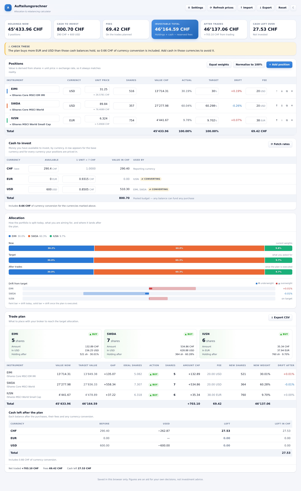
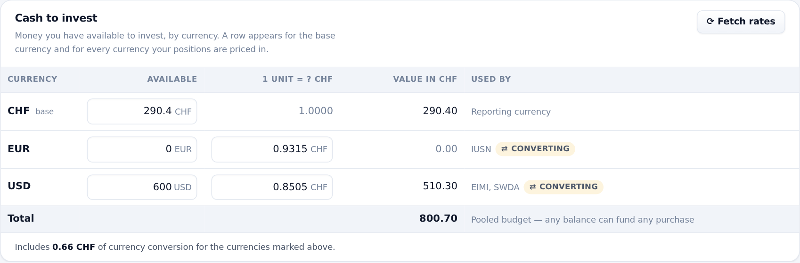
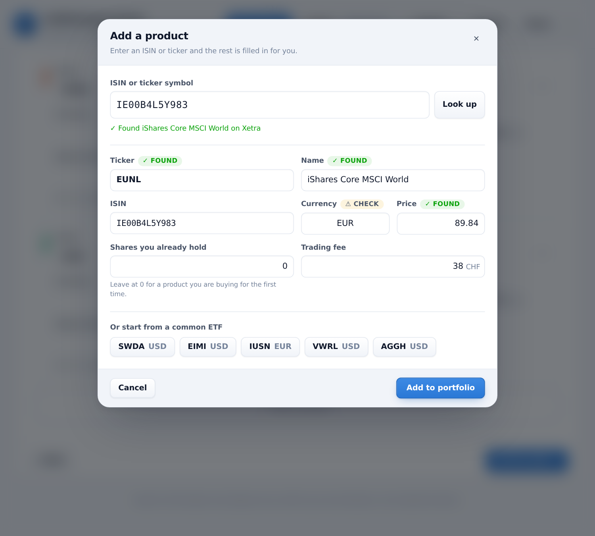
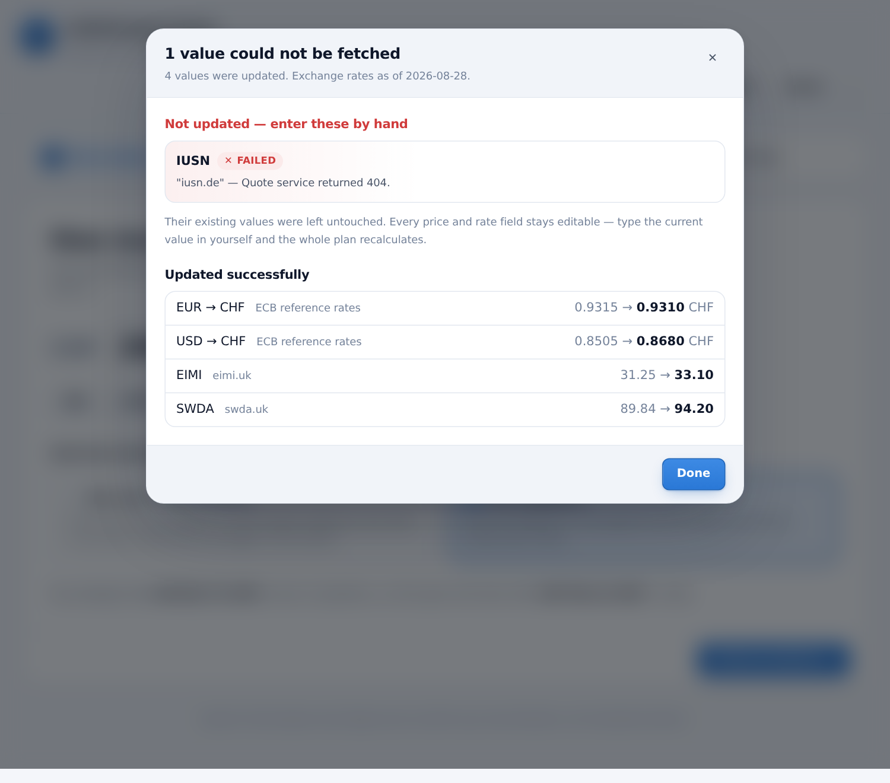

# Aufteilungsrechner — Portfolio Allocation & Rebalancing Calculator

A web app that replaces `Aufteilungsrechner.xlsx`: it works out **how many shares
to buy or sell** to bring a multi-currency portfolio back to its target
allocation, given the cash you want to add and the trading fees you will pay.

Unlike the spreadsheet it is not limited to three ETFs — positions are added,
removed, reordered and reweighted freely.

## The dashboard

One view, full width, in this order:

1. **Positions** — every holding: price, shares, value, actual vs. target weight,
   drift and fee. Add, remove, reorder, reweight.
2. **Cash to invest** — how much money you have, by currency (below).
3. **Allocation** — composition today, target, and after the plan, plus drift.
4. **Trade plan** — what to buy or sell, and what cash is left afterwards.

Calculation settings live in a dialog behind **Settings** in the header, so
nothing competes with the tables for width.



## Cash to invest

The section between *Positions* and *Allocation* is where the money goes in. It
holds one row per currency, and the rows look after themselves:

- the **base currency**, always first;
- **every currency your positions are priced in** — add a GBP-priced ETF and a
  GBP row appears on its own;
- **any currency still holding cash**, so money is never hidden when the last
  position using it is removed.

Each row carries the amount available, its **exchange rate** (editable right
there — the rates are not in Settings), and the value in the base currency. A
currency the plan has to convert into is marked, a currency with no rate yet is
flagged in red, and the footer totals the pooled budget.



## Quick start

```bash
npm install
npm run dev        # http://localhost:5173
```

Other scripts:

| Command | What it does |
| --- | --- |
| `npm run build` | Typecheck and build the static site into `dist/` |
| `npm run preview` | Serve the production build locally |
| `npm test` | Run the calculation tests |
| `npm run typecheck` | TypeScript only |

`dist/` is a plain static bundle — any static host will serve it.

---

## The calculation

The engine (`src/lib/calc.ts`) follows the same chain as the original sheet:

```
value_i     = shares_i × unitPrice_i × fxRate_i      # holdings, in base currency
investable  = Σ value + cash − fees                  # "Gesamt"           (Q6)
target_i    = investable × targetWeight_i            # "Soll"             (Q7:Q9)
delta_i     = target_i − value_i                     # "Diff zu Soll"     (Q10:Q12)
rawShares_i = delta_i / priceInBase_i                #                    (Q19:Q21)
trade_i     = round(rawShares_i)                     # ROUNDDOWN by default (E24:E26)
```

Fees are subtracted **before** the targets are computed, so the plan never
budgets money that the fees will consume.

### Two deliberate differences from the spreadsheet

1. **Position value is derived, not entered.** The sheet held each CHF value in
   its own cell (`D6:D8`), independent of shares × price — so its stated values
   drifted a few francs away from what the shares were actually worth. Here
   `shares × unit price × FX rate` is the single source of truth, and the value
   column can never go stale.
2. **A currency-conversion bug is fixed.** Cell `H25` divided the SWDA trade
   (a USD instrument) by the **EUR** rate. Each position now converts with its
   own currency's rate.

Both changes mean the app's final share counts can differ slightly from the
sheet's for the same inputs. The intermediate chain is identical, and
`src/lib/calc.test.ts` pins it to the spreadsheet's own numbers.

### Making the plan actually placeable

Three guarantees hold whatever the settings:

- **It never spends more cash than you have.** In buy-only mode, targets are
  derived from the whole portfolio but purchases are capped at the money on
  hand; when the targets are out of reach every buy is scaled back by the same
  factor, so each underweight product moves the same fraction of the way and
  none is starved. The app then says what it would take to close the gap
  entirely — and offers to raise the amount, or to allow selling, in one click.
- **Rounding never makes it unaffordable.** Sells round toward zero, so they
  raise less than the ideal while the buys they fund do not shrink. Any plan
  that ends up over budget has its least-needed buy trimmed a share at a time
  until it fits.
- **Leftover cash is put to work.** Rounding down strands a little money against
  every position at once. The leftover pass buys extra whole shares of whichever
  product is still furthest below target, as long as the share brings it closer
  to target than skipping it would.

### Money in several currencies

Cash to invest is held **per currency** — `1'000 CHF + 500 USD` — edited in the
*Cash to invest* section.

The balances form **one pooled budget**: converted at your exchange rates into a
single investable amount, so USD cash can fund a EUR purchase. What makes that
honest is that converting is not free — the part of a purchase your matching
balance cannot cover is charged a **spread** (0.25% by default) plus an optional
**flat fee per currency converted**. Both are set under *Settings → Currency conversion*, and the plan says so when
it has to convert:

> The plan buys more EUR and USD than those cash balances hold, so 0.60 CHF of
> currency conversion is included. Add cash in those currencies to avoid it.

Conversion cost, fees and the plan itself each depend on the others, so they are
resolved together by iterating to a fixed point — the same way per-trade fees
already were.

**Settling a purchase** drains the cheapest source first: the balance matching
what you are buying (which needs no conversion), then the base currency, then
the largest remaining balance. That order is deterministic, so the leftover
figures follow from the numbers on screen.

### Fees are in each position's own currency

A USD-listed ETF is charged in USD, a EUR-listed one in EUR. Totals convert into
the base currency for the summary, and both figures are reported —
`feeApplied` in the position's currency, `feeAppliedBase` in the base.

Upgrading a portfolio saved before this change keeps the fee *numbers* as they
were and re-reads them as the position's own currency: a fee of `20` on a
USD position now means 20 USD rather than 20 CHF.

### Fees: reserved vs. charged

`feeMode: 'all'` reserves every position's fee before the targets are computed —
conservative budgeting, and what the spreadsheet did. But a fee is only really
paid on a position that trades, so the app reports both: **reserved** feeds the
target chain, **charged** is what your broker will actually bill and what the
leftover cash is measured against. A plan that trades nothing is charged
nothing.

### Settings that change the plan

| Setting | Effect |
| --- | --- |
| **Share rounding — Toward zero** | Excel's `ROUNDDOWN`. The default: a −0.8-share gap is left alone rather than becoming a 1-share sell. |
| **Share rounding — Down** | Always rounds toward −∞, so small overweights *are* sold. |
| **Share rounding — Nearest** | Closest whole share; may spend slightly more than the available cash. |
| **Fees — Charge all** | Every position's fee is reserved up front (spreadsheet behaviour). |
| **Fees — Only if traded** | A fee is reserved only where a trade is actually planned. Fees and trades depend on each other, so this is resolved by iterating to a fixed point. |
| **Allow selling** | Off = buy-only rebalancing; overweight positions are left alone. |
| **Fractional shares** | Skips whole-share rounding entirely. |
| **Use up the leftover cash** | After the main plan, buy extra whole shares of whatever is still furthest below target. |
| **Hold — never trade** (per position) | The position counts toward the total but is never bought or sold, and is charged no fee. |

The app warns when target weights do not sum to 100%, when the plan needs more
cash than is available, and when a price or exchange rate is missing.

---

## Adding and removing products

*Add a product* (guided) and *+ Add position* (advanced) both open the same
dialog. Type an **ISIN or ticker**, leave the field, and the rest fills itself
in:



1. An ISIN is **checked locally first** — the check digit is verified before any
   request goes out, so a typo is caught immediately rather than coming back as
   "not found".
2. [OpenFIGI](https://www.openfigi.com/api) maps the code to a symbol, a name
   and a listing exchange. One ISIN usually lists on several venues; the one
   picked is whichever can be priced and has an unambiguous currency.
3. Stooq supplies the last price for that symbol.

Every field stays editable, and each carries a badge saying where its value came
from — **✓ found** for something the lookup established, **⚠ check** for
something inferred. Currency is always inferred: neither provider reports a
trading currency, so it is derived from the listing exchange, and a venue that
lists in several currencies (London especially) is left blank with a note rather
than guessed.

If a provider is unreachable or does not know the code, the dialog says so and
the form stays fully usable by hand. Presets for a few common ETFs are there for
when you have no code to hand. Removing a product you still hold asks first.

Expand a row (▸) in advanced mode for full name, ISIN, quote symbol and the
*hold* flag.

- **Normalise to 100%** scales every target proportionally so they add up.
- **Equal weights** gives every position `1/n`.
- Any currency code works — enter a rate for it under *Exchange rates*, or fetch
  live rates.

Beyond eight positions the chart colours fold into one neutral shade, because
nine categorical hues cannot be told apart reliably. The tables stay exact.

---

## Refreshing prices

**Refresh prices** in the header re-fetches every exchange rate and every share
price the portfolio needs, in one action.



When everything updates, a toast says how many values changed. When anything
does not, a report opens naming **each currency or product that failed and
why** — a symbol the provider does not know, a service that could not be
reached, a rate-limited request, or a position with no quote symbol to look up.

Two rules the report depends on:

- **A failure never overwrites a value.** Anything that could not be fetched
  keeps exactly what it had, so a price you typed in yourself is never replaced
  by a blank or a stale guess.
- **Partial success is still success.** One unreachable currency does not
  discard the rates that did arrive, and one bad ticker does not stop the other
  prices updating.

Every price and rate field stays editable throughout — the refresh is a
convenience, never a gate. Type a value in and the whole plan recalculates. A
quote symbol that turns out to work is remembered on the position, so the next
refresh is a single request.

The per-position *Fetch* button and the *Fetch live* button for exchange rates
are still there for refreshing one thing at a time.

## Live quotes

Both are optional; the app is fully usable with manual entry.

**Exchange rates** come from [Frankfurter](https://frankfurter.dev) (ECB
reference rates, no API key, CORS-enabled) and work straight from the browser.
Rates are stored as *base currency per 1 unit of the foreign currency* —
`1 USD = 0.8505 CHF`.

**Share prices** come from Stooq, which sends no CORS headers, so the browser
cannot call it directly. The Vite dev server proxies `/api/stooq` for local use.
To make *Fetch* work on a deployed build, put an equivalent proxy at that path.

**Instrument lookup** uses OpenFIGI, which needs no key and is documented as
CORS-enabled, so it is called directly. Should a browser refuse that call, the
lookup retries once through `/api/openfigi` — proxied in dev, and worth
configuring in production alongside the Stooq path.

As Netlify redirects in `netlify.toml`:

```toml
[[redirects]]
  from = "/api/stooq/*"
  to = "https://stooq.com/:splat"
  status = 200
  force = true

[[redirects]]
  from = "/api/openfigi/*"
  to = "https://api.openfigi.com/:splat"
  status = 200
  force = true
```

OpenFIGI allows roughly 25 lookups a minute without an API key; the dialog
reports rate limiting in plain words rather than failing silently.

Stooq symbols carry an exchange suffix: `swda.uk`, `iusn.de`. Without a proxy
the *Fetch* button reports that the service is unreachable and the price stays
whatever you typed.

---

## Data & storage

Everything lives in your browser's `localStorage` — no account, no server, and
nothing leaves the machine except the two optional quote requests above. Clearing
site data resets the app to the example portfolio.

- **Export** writes the whole portfolio as JSON.
- **Import** reads one back; missing or malformed fields are filled in rather
  than crashing.
- **Export CSV** (trade plan) writes a semicolon-separated file that Excel opens
  directly, with every intermediate figure per position.

Number entry accepts the formats a European spreadsheet user types:
`1'234.56`, `1.234,56` and `1234,56` all parse.

---

## Project layout

```
src/
  types.ts              Domain model
  lib/
    calc.ts             The rebalancing engine (pure, no React)
    isin.ts             ISIN shape and check-digit validation
    lookup.ts           ISIN/ticker → product, and its response parsing
    refresh.ts          Refresh-all orchestration and its per-item report
    storage.ts          localStorage, import hydration and the v1 → v2 migration
    calc.test.ts        Pinned to the spreadsheet's own numbers, plus the
                        affordability and leftover-cash guarantees
    isin.test.ts        Check digits, against ten real ISINs
    lookup.test.ts      Parsing and every failure path, on recorded responses
    quotes.test.ts      Provider request/response handling
    refresh.test.ts     Every refresh outcome, including partial failure
    storage.test.ts     The v1 → v2 migration and hydration robustness
    quotes.ts           Optional FX and price fetching
    exporters.ts        CSV / JSON output
    format.ts           Locale-aware formatting and parsing
    colors.ts           Categorical colour assignment
  components/
    CashToInvest        Per-currency cash and exchange rates
    AddProductDialog    ISIN/ticker lookup dialog
    SettingsDialog      Calculation settings
    *.tsx               The dashboard sections
  App.tsx               State, wiring, import/export
```

The engine is deliberately free of React so it can be reused, tested and ported
without the UI.

---

## Disclaimer

This is a calculator, not investment advice. Prices, exchange rates and fees are
whatever you enter or fetch; verify every order before placing it.
